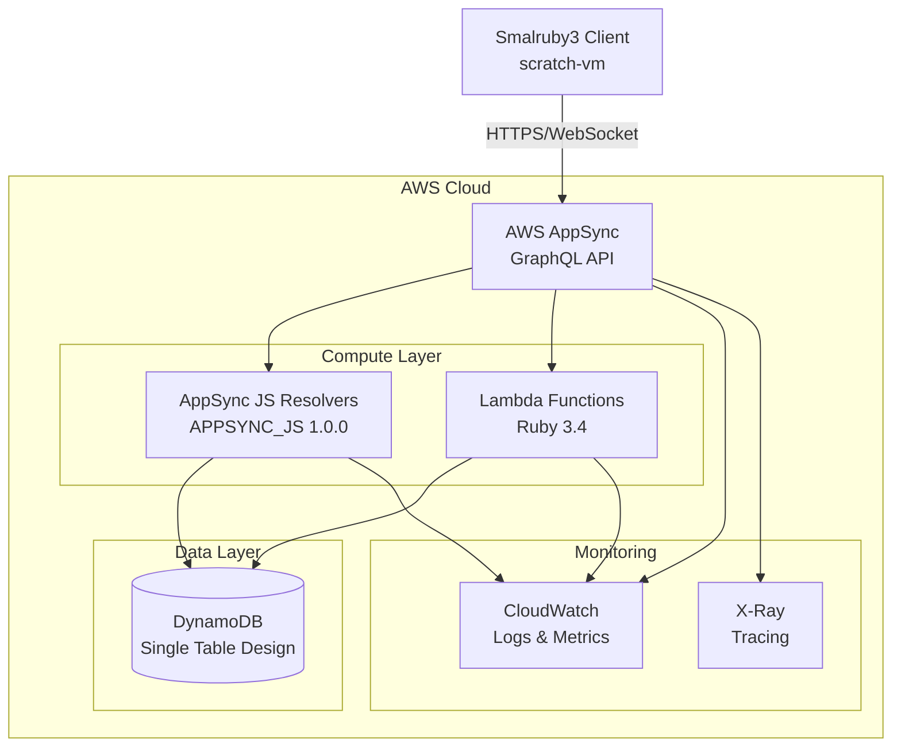
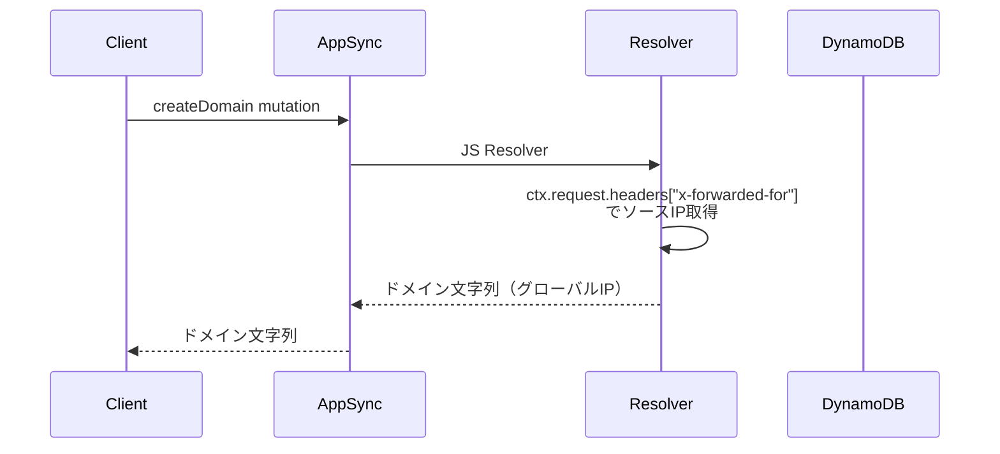
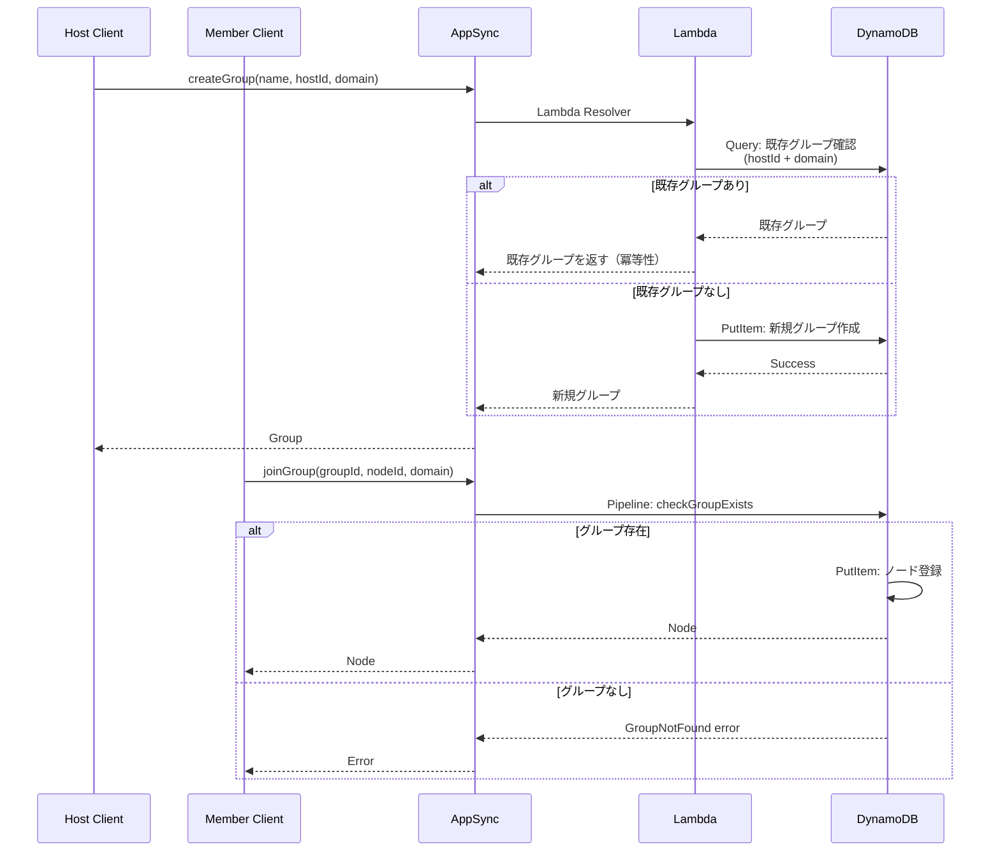
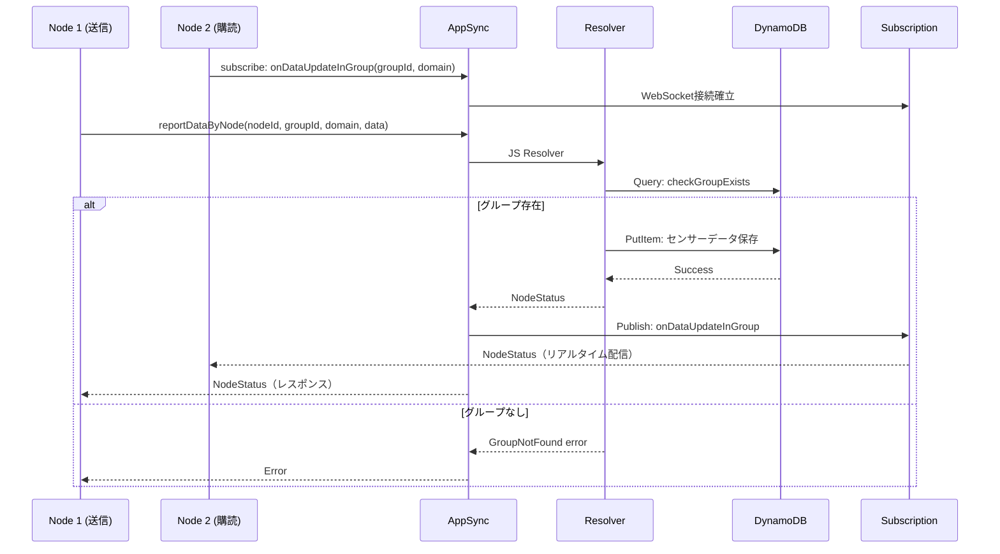
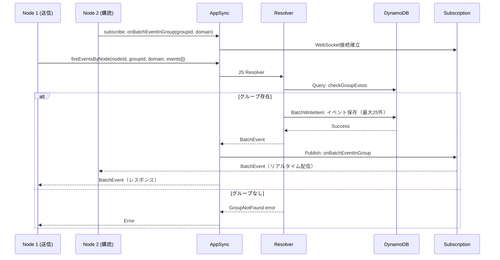
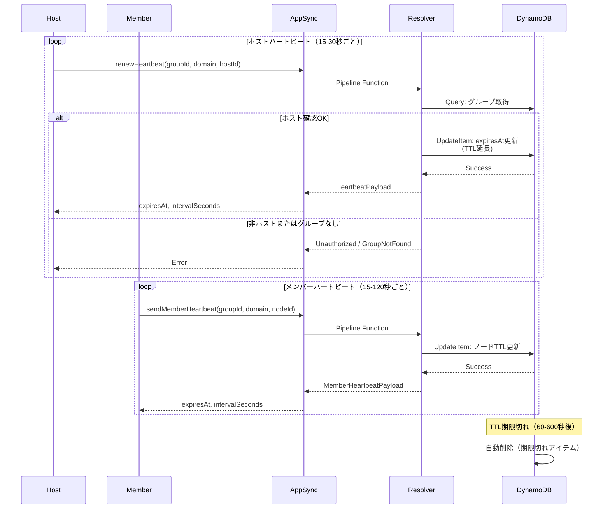
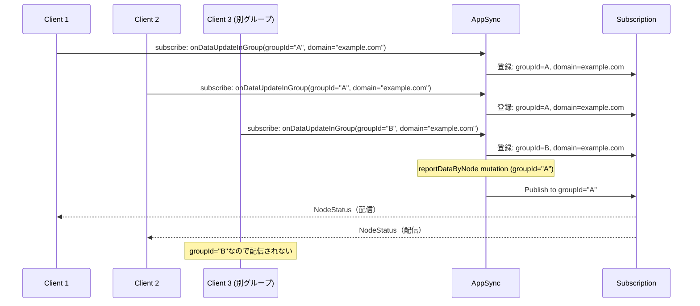
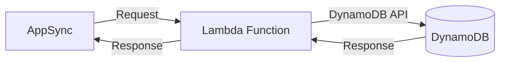
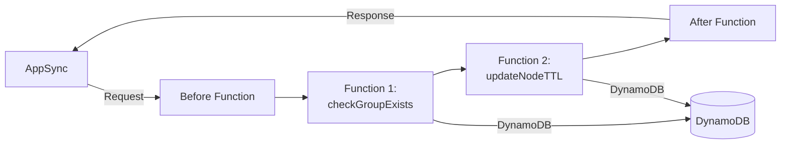
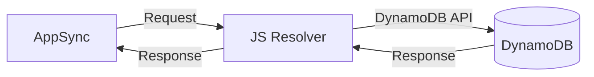

# Mesh v2 アーキテクチャドキュメント

このドキュメントは、Mesh v2 のシステムアーキテクチャ、データフロー、テーブル設計、リゾルバー処理フローを説明します。

## システム構成図



### コンポーネント説明

#### AWS AppSync
- **役割**: GraphQL API のエンドポイント
- **機能**:
  - Query/Mutation 処理
  - WebSocket Subscriptions
  - API Key 認証
  - リアルタイムデータ配信

#### AppSync JavaScript Resolvers
- **言語**: APPSYNC_JS 1.0.0
- **役割**: 軽量な CRUD 操作とパイプライン処理
- **例**:
  - `Query.listGroupsByDomain`
  - `Mutation.joinGroup`
  - Pipeline Functions (checkGroupExists, updateNodeTTL)

#### Lambda Functions (Ruby 3.4)
- **言語**: Ruby 3.4
- **アーキテクチャ**: Hexagonal Architecture（Ports & Adapters）
- **役割**: 複雑なビジネスロジック
- **例**:
  - グループ作成の冪等性処理
  - ハートビート更新とTTL管理

#### DynamoDB
- **設計**: Single Table Design
- **特徴**:
  - スケーラブル
  - 低レイテンシ
  - TTL による自動削除
  - GSI（Global Secondary Index）によるクエリ最適化

#### CloudWatch & X-Ray
- **CloudWatch Logs**: リゾルバーログ、Lambda ログ
- **CloudWatch Metrics**: API 呼び出し数、エラー率、レイテンシ
- **X-Ray**: 分散トレーシング、パフォーマンス分析

## データフロー図

### ドメイン作成フロー



### グループ作成・参加フロー



### センサーデータ送信フロー



### イベント送信フロー（バッチ）



### ハートビート更新フロー



### Subscription配信フロー



## DynamoDB テーブル設計

### Single Table Design

Mesh v2 は Single Table Design を採用し、1つのテーブルにすべてのエンティティを格納します。

#### テーブル: MeshV2Table

| Attribute | Type | Description |
|-----------|------|-------------|
| `pk` (Partition Key) | String | パーティションキー |
| `sk` (Sort Key) | String | ソートキー |
| `ttl` | Number | Time To Live（Unix timestamp） |
| `GSI1PK` | String | GSI1 パーティションキー |
| `GSI1SK` | String | GSI1 ソートキー |
| その他 | - | エンティティ固有の属性 |

#### GSI (Global Secondary Index)

- **GSI1**: `GSI1PK` (Partition Key), `GSI1SK` (Sort Key)
  - 用途: ドメインごとのグループ一覧取得

### エンティティ設計

#### 1. グループ (Group)

**PK**: `DOMAIN#{domain}`
**SK**: `GROUP#{groupId}#METADATA`
**GSI1PK**: `DOMAIN#{domain}`
**GSI1SK**: `GROUP#{createdAt}`
**TTL**: `expiresAt` (Unix timestamp)

**属性**:
```json
{
  "pk": "DOMAIN#192.168.1.1",
  "sk": "GROUP#abc123#METADATA",
  "GSI1PK": "DOMAIN#192.168.1.1",
  "GSI1SK": "GROUP#2026-01-01T00:00:00Z",
  "groupId": "abc123",
  "domain": "192.168.1.1",
  "name": "My Group",
  "hostId": "node-001",
  "createdAt": "2026-01-01T00:00:00Z",
  "expiresAt": 1704067200,
  "ttl": 1704067200
}
```

**アクセスパターン**:
- グループ取得: `pk = DOMAIN#{domain} AND sk = GROUP#{groupId}#METADATA`
- ドメイン内グループ一覧: `GSI1: GSI1PK = DOMAIN#{domain} AND begins_with(GSI1SK, "GROUP#")`

---

#### 2. ノード (Node)

**PK**: `GROUP#{groupId}@{domain}`
**SK**: `NODE#{nodeId}`
**TTL**: メンバーハートビートによる TTL

**属性**:
```json
{
  "pk": "GROUP#abc123@192.168.1.1",
  "sk": "NODE#node-001",
  "nodeId": "node-001",
  "name": "Node 1",
  "groupId": "abc123",
  "domain": "192.168.1.1",
  "heartbeatIntervalSeconds": 120,
  "ttl": 1704067200
}
```

**アクセスパターン**:
- ノード取得: `pk = GROUP#{groupId}@{domain} AND sk = NODE#{nodeId}`
- グループ内ノード一覧: `pk = GROUP#{groupId}@{domain} AND begins_with(sk, "NODE#")`

---

#### 3. ノードステータス (NodeStatus)

**PK**: `NODE#{nodeId}`
**SK**: `STATUS#LATEST`

**属性**:
```json
{
  "pk": "NODE#node-001",
  "sk": "STATUS#LATEST",
  "nodeId": "node-001",
  "groupId": "abc123",
  "domain": "192.168.1.1",
  "data": [
    {"key": "temperature", "value": "25.5"},
    {"key": "humidity", "value": "60"}
  ],
  "timestamp": "2026-01-01T12:00:00Z"
}
```

**アクセスパターン**:
- ノードステータス取得: `pk = NODE#{nodeId} AND sk = STATUS#LATEST`
- グループ内全ステータス: スキャン（非効率、改善の余地あり）

---

#### 4. イベント (Event)

**PK**: `GROUP#{groupId}@{domain}`
**SK**: `EVENT#{timestamp}#{eventId}`

**属性**:
```json
{
  "pk": "GROUP#abc123@192.168.1.1",
  "sk": "EVENT#2026-01-01T12:00:00.123Z#evt-001",
  "eventName": "button_clicked",
  "firedByNodeId": "node-001",
  "groupId": "abc123",
  "domain": "192.168.1.1",
  "payload": "{\"button\":\"A\"}",
  "timestamp": "2026-01-01T12:00:00.123Z"
}
```

**アクセスパターン**:
- グループ内イベント一覧: `pk = GROUP#{groupId}@{domain} AND begins_with(sk, "EVENT#")`
- 時系列イベント取得: Sort Key でソート

---

### TTL (Time To Live) 設計

DynamoDB の TTL 機能を使用して、期限切れアイテムを自動削除します。

| エンティティ | TTL 属性 | TTL 期間 | 更新方法 |
|------------|----------|---------|---------|
| Group | `ttl` | ホストハートビート間隔 × 5 | `renewHeartbeat` mutation |
| Node | `ttl` | メンバーハートビート間隔 × 5 | `sendMemberHeartbeat` mutation |
| NodeStatus | なし | TTL なし（最新状態のみ保持） | - |
| Event | TTL 設定可能（将来） | 設定可能 | - |

**TTL の利点**:
- 自動クリーンアップ（手動削除不要）
- コスト削減（古いデータの削除）
- ハートビート失敗時の自動切断

## リゾルバー処理フロー

### Direct Lambda Resolver

Lambda 関数を直接呼び出すリゾルバー。



**使用例**:
- 複雑なビジネスロジック
- 冪等性処理
- Hexagonal Architecture の活用

---

### Pipeline Resolver (AppSync JS)

複数の関数を組み合わせたパイプライン処理。



**使用例**:
- `joinGroup`: グループ存在確認 → ノード登録
- `reportDataByNode`: グループ存在確認 → データ保存 → Subscription 配信
- `renewHeartbeat`: ホスト確認 → TTL 更新

**利点**:
- 軽量で高速
- Lambda コールドスタート回避
- コスト削減

---

### Unit Resolver (AppSync JS)

単一の DynamoDB 操作を実行するリゾルバー。



**使用例**:
- `Query.getGroup`: シンプルな GetItem
- `Query.listGroupsByDomain`: GSI クエリ
- `Mutation.createDomain`: ソース IP 取得（DynamoDB 不要）

---

## セキュリティ設計

### 認証

現在: **API Key 認証**

```http
POST /graphql HTTP/1.1
Host: xxx.appsync-api.ap-northeast-1.amazonaws.com
x-api-key: da2-xxxxxxxxxxxxxxxxxxxxxxxx
Content-Type: application/json
```

**将来の拡張**:
- IAM 認証（AWS リソースからのアクセス）
- Cognito ユーザープール（ユーザー認証）

---

### 認可

#### ホスト専用操作

以下の mutation はホストのみが実行可能:
- `renewHeartbeat`
- `dissolveGroup`

**実装**: リゾルバーで `hostId` を検証。非ホストは `Unauthorized` エラー。

#### グループメンバー確認

以下の操作はグループメンバーのみが実行可能:
- `reportDataByNode`
- `fireEventsByNode`
- `sendMemberHeartbeat`

**実装**: リゾルバーで `nodeId` がグループに所属しているか確認。

---

### データ検証

#### ドメイン長制限

- **最大長**: 256 文字
- **実装**: GraphQL schema と DynamoDB 属性で検証

#### グループ存在確認

すべてのグループ操作で、グループが存在するか確認:
- `GroupNotFound` エラーでクライアントに即座に切断を指示

---

## パフォーマンス設計

### イベントバッチング

複数イベントを一度に送信（`fireEventsByNode`）:
- **クライアント側**: 50ms バッファリング
- **サーバー側**: BatchWriteItem で最大 25 件を一括書き込み
- **Subscription**: 1回の配信で複数イベントを送信

**利点**:
- API 呼び出し数削減（コスト削減）
- ネットワーク帯域幅削減
- レイテンシ削減

---

### 接続タイムアウト

グループの最大接続時間を制限:
- **デフォルト**: `MESH_MAX_CONNECTION_TIME_MINUTES` (開発: 10分、本番: 50分)
- **カスタマイズ**: `createGroup` の `maxConnectionTimeSeconds` パラメータ

**実装**: グループ作成時に `expiresAt` を設定。ハートビートで延長可能だが、最大時間を超えない。

---

### Single Table Design の最適化

#### GSI によるクエリ最適化

- **GSI1**: ドメインごとのグループ一覧取得を高速化
- **Sort Key**: 時系列データのソート（イベント、グループ作成日時）

#### Partition Key の分散

- `DOMAIN#{domain}` をパーティションキーに使用
- 異なるドメインは異なるパーティションに分散
- ホットパーティション回避

---

### ハートビート間隔の調整

| 環境 | ホスト間隔 | メンバー間隔 | 理由 |
|------|-----------|-------------|------|
| 開発 | 15秒 | 15秒 | 高速デバッグ、TTL 確認 |
| 本番 | 30秒 | 120秒 | コスト削減（~70%）、UX 維持 |

**TTL**: 間隔の 5 倍（ネットワーク問題に対する耐性）

---

## スケーリング考慮事項

### DynamoDB オートスケーリング

- **Read Capacity**: オンデマンドモード（自動スケーリング）
- **Write Capacity**: オンデマンドモード（自動スケーリング）
- **利点**: トラフィックの急増に自動対応

---

### AppSync スケーリング

- **API 呼び出し**: 自動スケーリング（AWS 管理）
- **WebSocket 接続**: 最大 100,000 接続/アカウント/リージョン
- **Subscription 配信**: 自動スケーリング

---

### Lambda 同時実行数

- **デフォルト**: アカウントごとに 1,000 同時実行
- **予約済み同時実行**: 必要に応じて設定可能
- **コールドスタート**: Pipeline Resolver で回避

---

## 関連ドキュメント

- [API リファレンス](api-reference.md) - GraphQL API の完全リファレンス
- [開発ガイド](development.md) - ローカル開発とテスト
- [デプロイ手順](deployment.md) - 初回デプロイから運用まで
- [README.md](../README.md) - プロジェクト概要

---

**Last Updated**: 2026-01-01
**Phase**: 4-2 - Architecture Documentation
**Status**: ✅ Complete
